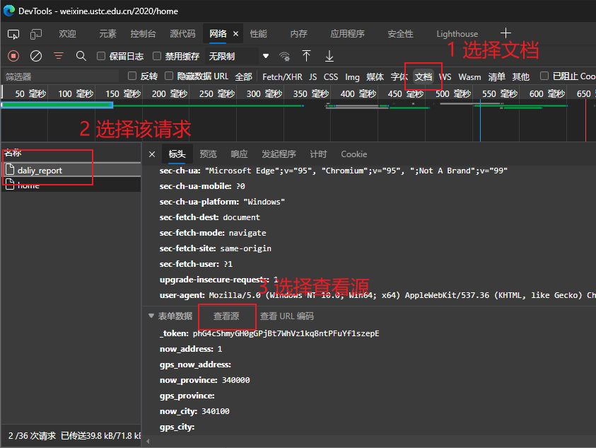
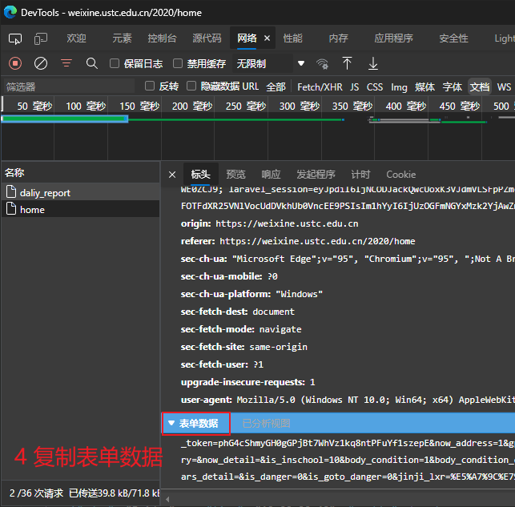

### 说明

使用python实现的USTC每日健康打卡程序

### 依赖

本项目依赖于以下python库：

- requests
- lxml
- urllib

安装依赖：

```bash
pip install -r requirements.txt
```

### 使用

1. 复制`config-template.json`为`config.json`

2. 填写`username`，`password`

3. 填写`report_post_str`：该字段需要抓取浏览器网络请求。方法如下：

  1. 浏览器访问[中国科大健康打卡平台 - 登录 (ustc.edu.cn)](https://weixine.ustc.edu.cn/2020/login)，并登录，直到点击“确认上报”

  2. 打开开发者工具（快捷键F12）

  3. 点击“确认上报”

  4. 按照图示，获取字段

     

     

  5. 运行脚本

     ```
     python main.py
     ```